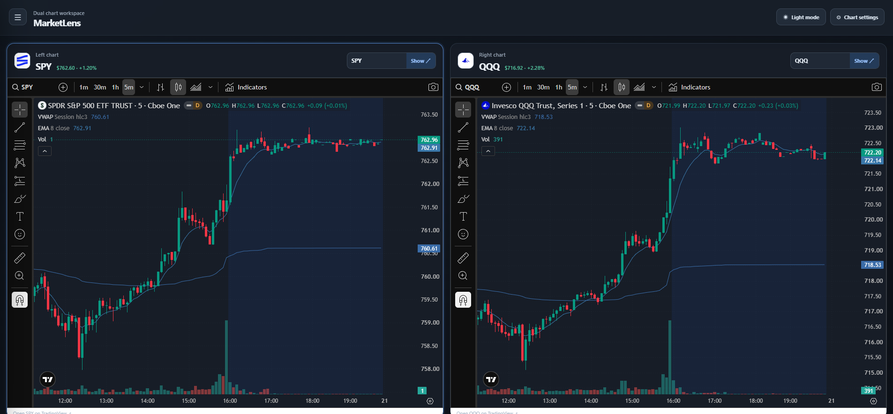

# MarketLens

[English](README.md) | **日本語** | [简体中文](README.zh-CN.md)

MarketLens は、Windows・macOS・Android 向けの Tauri 2 製株価ウォッチアプリです。TradingView のチャートを左右に2つ表示し、初期銘柄は SPY と QQQ、初期足種は5分足です。描画ツールから水平線などを引けます。ハンバーガーメニューでウォッチリストを開き、各チャート上部のティッカー入力欄またはリストの銘柄を選んで表示を切り替えます。

## HTML デモ

[demo.html](demo.html) をブラウザで開くと、ビルドせずに画面を確認できます。ウォッチリストの並べ替え、候補銘柄の表示、ティッカー入力、サイドバーの開閉、テーマ切替を試せます。デモの株価と候補スコアは表示例です。TradingView チャートの読み込みにはインターネット接続が必要で、ブラウザ環境によっては埋め込みが制限される場合があります。

## 主な機能

- 添付画像にあった21銘柄を、前日終値に対する変動率の高い順に表示
- ウォッチリストにティッカー、株価、変動率を表示
- 添付の PBInvesting ロジック資料を基に、強い候補と弱い候補を各3銘柄表示
- 独立した2つの TradingView チャート、ティッカーの保存、手動更新、2分ごとの株価更新
- ダークモードを初期表示とし、ライトモードへの切替結果を端末に保存
- Chart settings で時間外取引、VWAP、8 EMA の初期設定を保存し、銘柄変更時に再適用

## 開発環境で起動

[Rust](https://www.rust-lang.org/tools/install)、[Tauri の前提条件](https://tauri.app/start/prerequisites/)、[pnpm](https://pnpm.io/installation)をインストールし、プロジェクトのルートで実行します。

```sh
pnpm install --frozen-lockfile
pnpm tauri dev
```

Windows・macOS・Android のビルド方法、必要なツール、生成物の場所は[ビルド手順](BUILDING.ja.md)に記載しています。`pnpm dev` はブラウザでフロントエンドを確認するためのコマンドです。開発時は Vite のプロキシ、Tauri アプリでは Rust 側の処理で株価を取得します。

## 株価データと候補の順位付け

チャートは TradingView の埋め込みウィジェットを使用します。サイドバーの株価は、時間外取引を含む Yahoo Finance の公開チャートエンドポイントから1分足データを別途取得します。このエンドポイントは非公式で、データの遅延、アクセス制限、取得失敗が起こり得ます。価格が取得できない場合は架空の数値で補わず、取得できない状態を表示します。株価と候補の計算に使う取引時間帯が異なる場合もあります。

候補の暫定スコアは QQQ を基準とし、QQQ・SPY・IWM を候補から除外します。通常取引では、始値からの相対騰落率（45%）、直近5分の相対騰落率（30%）、終値から近似した VWAP との位置関係（15%）、直近の出来高とそれ以前の20本との比較（10%）を使用します。プレマーケットでは前日終値からのギャップを基準に、相対ギャップ（70%）と直近の相対モメンタム（30%）を使用します。候補の入れ替えには、新しい銘柄が既存候補を5点以上上回る状態が2回連続で必要です。これらは実装上の推定値であり、価格予測や売買シグナルではありません。

資料にある PMH/PML、より厳密な相対出来高、流動性フィルターはこの MVP には実装していません。実運用には信頼できる日中の分足データの提供元が必要です。

## TradingView ウィジェットの制約

無料の埋め込みウィジェットからは、TradingView 内で作成した描画やインジケーターの詳細なレイアウトをアプリ側で保存・復元できません。テーマや銘柄の切替時にチャートを読み直すため、ウィジェット内の変更は保持されません。完全なレイアウト保存には TradingView Advanced Charts ライブラリの利用権と、別途データフィードおよび保存先が必要です。

8 EMA の期間指定は反映されますが、無料ウィジェットではインジケーターの色指定が安定して反映されません。そのため、VWAP の黄色はアプリ側の初期設定として保証できていません。また、TradingView 内部の銘柄選択は MarketLens のサイドバーとは連動しません。

## ディレクトリ構成

- `src/main.ts`：画面、チャート、株価更新
- `src/market.ts`：騰落率、VWAP、候補スコアの計算
- `src-tauri/src/lib.rs`：株価データの取得と整形
- `src/style.css`：デスクトップとモバイルの表示
- `demo.html`：単体で開ける HTML デモ
- `BUILDING.ja.md`：プラットフォーム別のビルド手順
