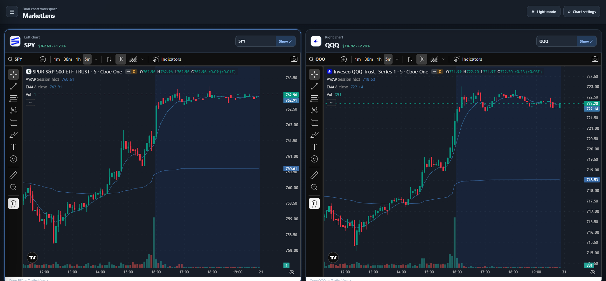

# MarketLens

[English](README.md) | **日本語** | [简体中文](README.zh-CN.md)

MarketLens は、Windows・macOS・Android 向けの Tauri 2 製株価ウォッチアプリです。Windows と macOS では TradingView のチャートを左右に2つ表示し、初期銘柄は SPY と QQQ、初期足種は5分足です。Android は株価一覧、ランキング、セットアップ、通知に絞った軽量なモニター画面で、TradingView チャートを読み込みません。

## HTML デモ

[demo.html](demo.html) をブラウザで開くと、ビルドせずに画面を確認できます。ウォッチリストの並べ替え、候補銘柄、Active Setupsとタイムライン、ティッカー入力、サイドバーの開閉、テーマ切替を試せます。デモの株価、候補スコア、セットアップ状態は表示例です。TradingView チャートの読み込みにはインターネット接続が必要で、ブラウザ環境によっては埋め込みが制限される場合があります。

## 主な機能

- 添付画像にあった21銘柄を、前日終値に対する変動率の高い順に表示
- ウォッチリストにティッカー、株価、変動率を表示
- 添付の PB Investing ロジック資料を基に、強い候補と弱い候補を各3銘柄表示
- 重要レベル突破、確定5分足、リテスト、反応までCALL / PUTセットアップを自動監視
- 状態履歴付きのActive Setupカード、`SETUP_READY`初回のみのOS通知、Paper Modeへの仮想エントリー保存
- Windows・macOS向けの独立した2つの TradingView チャート、ティッカーの保存、手動更新、二段階の株価更新
- Androidではウォッチリストを全画面のメイン画面として表示し、TradingViewを読み込まないことでWebViewと通信の負荷を軽減
- ニューヨーク時間、現在の市場区分、次の開場または閉場までの残り時間をリアルタイム表示
- ダークモードを初期表示とし、ライトモードへの切替結果を端末に保存
- Chart settings で時間外取引、VWAP、8 EMA の初期設定を保存し、銘柄変更時に再適用

## 開発環境で起動

[Rust](https://www.rust-lang.org/tools/install)、[Tauri の前提条件](https://tauri.app/start/prerequisites/)、[pnpm](https://pnpm.io/installation)をインストールし、プロジェクトのルートで実行します。

```sh
pnpm install --frozen-lockfile
pnpm tauri dev
```

Windows・macOS・Android のビルド方法、必要なツール、生成物の場所、DockerだけでAndroid版を作る手順は[ビルド手順](BUILDING.ja.md)に記載しています。`pnpm dev` はブラウザでフロントエンドを確認するためのコマンドです。開発時は Vite のプロキシ、Tauri アプリでは Rust 側の処理で株価を取得します。

## セットアップ監視

既存のStrong / Weakランキングを第一段階のフィルターとして維持しています。通常取引時間中、Strong Top 3をCALL候補、Weak Top 3をPUT候補として監視します。PMH/PMLは04:00–09:30 ET、PDH/PDLは前営業日の通常取引、VWAPは当日の通常取引OHLCのTypical Priceと出来高から計算します。OHLCが欠損した足はcloseから補完せず除外します。

状態は `CANDIDATE → BREAKOUT_DETECTED → BREAKOUT_CONFIRMED → RETEST_WAIT → RETEST_DETECTED → SETUP_READY` と進みます。CALLはPMH、PDH、VWAP、PUTはPML、PDL、VWAPの順にレベルを選びます。ブレイク後に確定した5分足だけをconfirmationに使い、リテストでレベルを維持した後、次の1分足がセットアップ方向へ反応した場合にREADYとなります。古いデータではREADY通知を出しません。`INVALIDATED`、`EXPIRED`、`DATA_STALE`で停止・保留理由も記録します。

添付のPB Investing資料から採用したのは、相対的な強弱、重要レベル、5分足確定、リテストという定性的な流れです。スコア配分、許容幅、VWAPフィルター、候補入れ替え条件、データ鮮度、期限は、判定を定量化してテスト可能にするためのMarketLens独自ルールです。`SETUP READY`は設定条件が一致したことを示すだけで、売買を指示する表現ではありません。

初期値は `src/config.ts` に集約しています。全銘柄90秒、アクティブ銘柄20秒、リテスト許容幅0.15%、無効化幅0.30%、セットアップ期限45分、候補離脱猶予10分、データ鮮度180秒です。CALL / PUTともVWAP条件を有効にしています。通常取引のランキング配分は相対パフォーマンス45%、相対5分モメンタム30%、VWAP位置15%、相対出来高10%、プレマーケットは70%と30%です。候補入れ替えは5点差を2回連続で要求します。

## 株価データと候補の順位付け

チャートは TradingView の埋め込みウィジェットを使用します。サイドバーの株価は、時間外取引を含む Yahoo Finance の公開チャートエンドポイントから1分足データを別途取得します。このエンドポイントは非公式で、データの遅延、アクセス制限、取得失敗が起こり得ます。価格が取得できない場合は架空の数値で補わず、取得できない状態を表示します。株価と候補の計算に使う取引時間帯が異なる場合もあります。

候補の暫定スコアは QQQ を基準とし、QQQ・SPY・IWM を候補から除外します。数値の重みとランキング閾値はすべてMarketLens独自の実装であり、PB Investing本人が公開した数値ではありません。

起動時に前営業日のレベルを作るため5日分を一度取得します。その後は全銘柄を90秒ごと、アクティブ候補、セットアップ、SPY、QQQ、表示中ティッカーを20秒ごとに、いずれも1日分だけ更新します。`MarketDataProvider`でデータ取得を分離しているため、将来Polygon、Alpaca、Finnhubへ移行する場合は`YahooFinanceProvider`を差し替え、ランキングと状態機械は再利用できます。Yahoo Financeのチャートエンドポイントは非公式で、リアルタイム性、完全性、可用性を保証しません。本番通知には信頼できるライセンス済みデータが必要です。

MarketLensのVWAPは通常取引時間の `(high + low + close) / 3 × volume` で計算します。TradingView側はセッションやデータ処理が異なる場合があるため、埋め込みチャートのVWAPと多少ずれる可能性があります。

## TradingView ウィジェットの制約

無料の埋め込みウィジェットからは、TradingView 内で作成した描画やインジケーターの詳細なレイアウトをアプリ側で保存・復元できません。テーマや銘柄の切替時にチャートを読み直すため、ウィジェット内の変更は保持されません。完全なレイアウト保存には TradingView Advanced Charts ライブラリの利用権と、別途データフィードおよび保存先が必要です。

8 EMA の期間指定は反映されますが、無料ウィジェットではインジケーターの色指定が安定して反映されません。そのため、VWAP の黄色はアプリ側の初期設定として保証できていません。また、TradingView 内部の銘柄選択は MarketLens のサイドバーとは連動しません。

## ディレクトリ構成

- `src/main.ts`：画面連携、チャート、二段階更新
- `src/market.ts`：騰落率と候補スコアの計算
- `src/setup.ts`：重要レベル、5分足生成、純粋な状態機械
- `src/config.ts`：ランキングとセットアップの閾値
- `src/provider.ts`：差し替え可能なデータ取得とYahoo Finance実装
- `src/notifications.ts`：権限確認と重複防止を行うTauri通知
- `src/storage.ts`：セットアップ履歴とPaper Mode
- `src-tauri/src/lib.rs`：株価データの取得と整形
- `src/style.css`：デスクトップとモバイルの表示
- `demo.html`：単体で開ける HTML デモ
- `BUILDING.ja.md`：プラットフォーム別のビルド手順
- `Dockerfile.android` と `scripts/build-android-docker.sh`：再現可能なAndroidビルド環境
